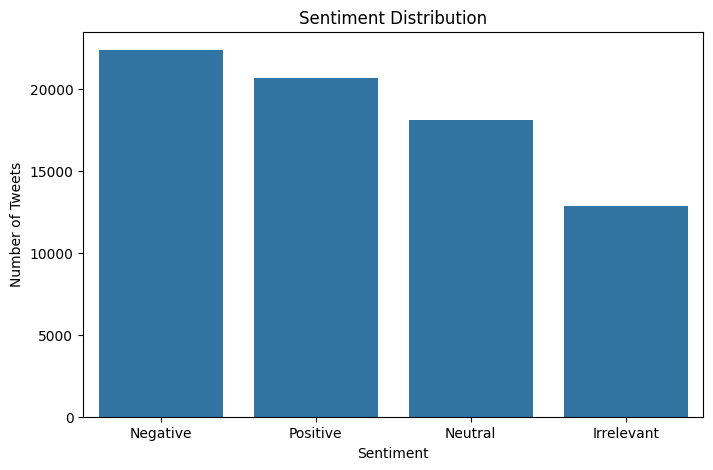
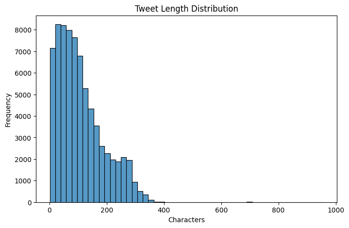
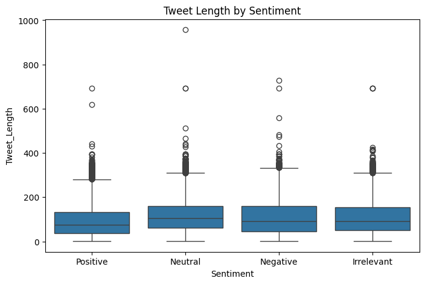
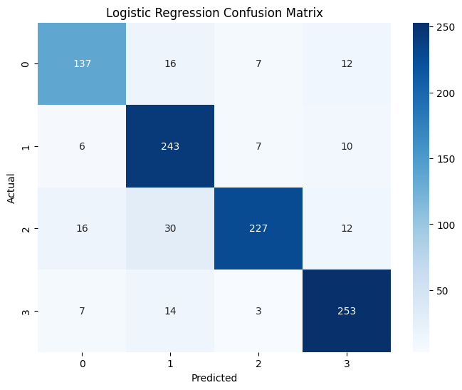
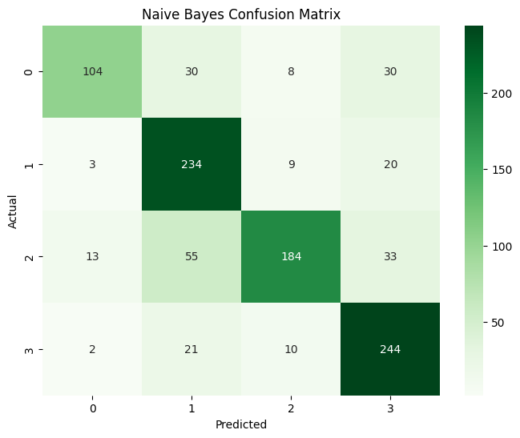
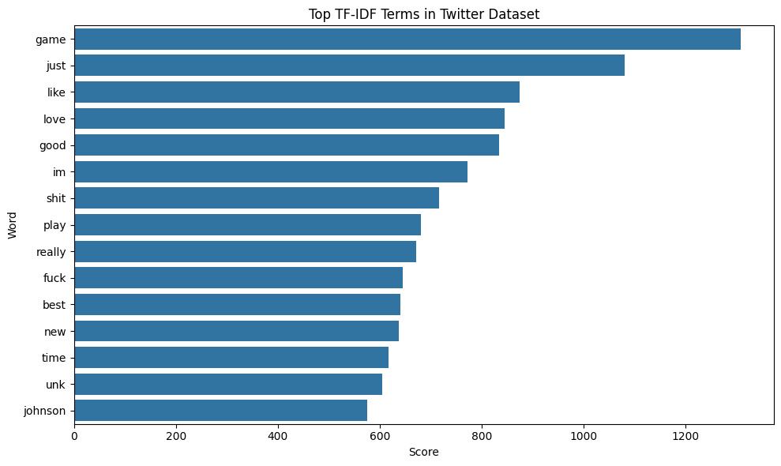

# 💬 Twitter Sentiment Analysis Using Natural Language Processing

## Overview

Social media platforms generate vast amounts of user-generated content every day. Understanding public sentiment toward brands, products, services, and events has become increasingly important for organizations seeking to improve customer engagement and monitor public perception.

This project develops a Natural Language Processing (NLP) pipeline for sentiment classification using Twitter data. The objective is to automatically classify tweets into sentiment categories and evaluate the effectiveness of machine learning algorithms for large-scale sentiment analysis.

The project applies text preprocessing, TF-IDF feature extraction, and machine learning classification techniques to analyze over 74,000 tweets.

---

## Business Problem

Organizations continuously receive customer feedback through social media platforms.

Manual analysis of thousands of daily posts is impractical.

Sentiment analysis enables businesses to:

- Monitor public opinion
- Detect negative customer experiences
- Measure brand perception
- Track customer engagement
- Support data-driven marketing strategies
- Improve customer relationship management

This project aims to automatically classify social media posts according to sentiment and evaluate the effectiveness of machine learning techniques for sentiment prediction.

---

## Dataset

### Source

Twitter Entity Sentiment Analysis Dataset

### Dataset Summary

| Metric | Value |
|----------|----------|
| Training Tweets | 73,996 |
| Validation Tweets | 1,000 |
| Total Tweets | 74,996 |
| Sentiment Classes | 4 |

### Sentiment Categories

- Positive
- Negative
- Neutral
- Irrelevant

### Dataset Features

| Feature | Description |
|----------|----------|
| TweetID | Unique Tweet Identifier |
| Entity | Brand or Topic Mentioned |
| Sentiment | Target Variable |
| Tweet | Raw Tweet Text |

---

## Technologies Used

- Python
- Pandas
- NumPy
- Matplotlib
- Seaborn
- Scikit-learn
- TF-IDF Vectorization
- Natural Language Processing (NLP)
- Google Colab
- Jupyter Notebook

---

## Methodology

### 1. Data Cleaning

The following preprocessing techniques were applied:

- Missing value removal
- Lowercase conversion
- URL removal
- Username removal
- Hashtag removal
- Number removal
- Punctuation removal
- Whitespace normalization

### 2. Exploratory Data Analysis

Exploratory analysis was conducted to understand:

- Sentiment distribution
- Tweet length distribution
- Tweet length variations across sentiment categories

### 3. Text Preprocessing

Raw tweet text was transformed into a structured format suitable for machine learning.

Preprocessing included:

- Text normalization
- Noise removal
- Token preparation

### 4. Feature Extraction

TF-IDF (Term Frequency-Inverse Document Frequency) vectorization was applied to convert textual information into numerical features.

Configuration:

```text
Max Features: 10,000
Stop Words Removed
```

### 5. Machine Learning Models

Two classification algorithms were developed and evaluated:

#### Logistic Regression

A linear classification algorithm commonly used for NLP tasks and high-dimensional sparse data.

#### Multinomial Naive Bayes

A probabilistic classifier frequently used as a baseline for text classification problems.

---

## Model Performance

### Logistic Regression

| Metric | Score |
|----------|----------|
| Accuracy | 86.0% |
| Weighted F1-Score | 0.86 |
| Macro F1-Score | 0.86 |

### Naive Bayes

| Metric | Score |
|----------|----------|
| Accuracy | 76.6% |
| Weighted F1-Score | 0.76 |
| Macro F1-Score | 0.76 |

### Best Performing Model

Logistic Regression achieved the strongest overall performance and significantly outperformed Naive Bayes across all evaluation metrics.

---

## Results

### Sentiment Distribution

The dataset contains a balanced representation of sentiment categories, providing a suitable foundation for multi-class classification.



---

### Tweet Length Distribution

Most tweets contain between 20 and 150 characters, with a small number of longer outliers.



---

### Tweet Length by Sentiment

Tweet length distributions show substantial overlap between sentiment categories, indicating that tweet length alone is not a strong predictor of sentiment.



---

### Logistic Regression Confusion Matrix

The Logistic Regression model achieved strong classification performance across all four sentiment categories.



---

### Naive Bayes Confusion Matrix

The Naive Bayes classifier demonstrated reasonable performance but was consistently outperformed by Logistic Regression.



---

### Top TF-IDF Terms

The most influential terms within the dataset were identified using TF-IDF frequency analysis.



---

## Key Findings

### Sentiment Classification

- Logistic Regression achieved an accuracy of 86%.
- Sentiment classes were effectively distinguished despite similarities between neutral and negative content.
- The model generalized successfully to an independent validation dataset.

### Text Characteristics

- Most tweets were relatively short.
- Tweet length alone was not a reliable predictor of sentiment.
- Vocabulary and word usage patterns provided significantly stronger predictive power.

### NLP Performance

- TF-IDF vectorization successfully transformed unstructured text into meaningful numerical features.
- Logistic Regression proved highly effective for high-dimensional text classification tasks.

---

## Business Applications

Potential applications include:

- Brand monitoring
- Customer feedback analysis
- Product review analysis
- Reputation management
- Social media analytics
- Marketing campaign evaluation
- Customer experience monitoring

---

## Future Improvements

Potential future enhancements include:

- Deep Learning Models (LSTM, GRU, Transformers)
- BERT-based Sentiment Classification
- Real-Time Tweet Streaming
- Sentiment Trend Dashboards
- Topic Modelling
- Named Entity Recognition (NER)
- Power BI Integration

---

## Author

**Mirza Gohar Baig Barlas**
